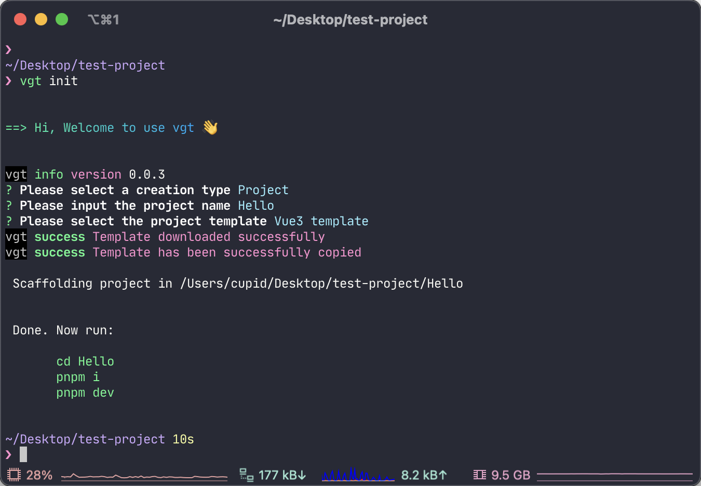

# vgt


## Description
A CLI tool for quickly creating my own Vue3 template and React18-template. 😊

I build it just for fun, it is still in progress. 🤭

And the template, it's just the most concise state right now, nothing has been added. And I will continue to update and integrate more configurations for ease of use at work. 😏




## Install

```sh

# use yarn
yarn global add vgt

# use pnpm
pnpm i -g vgt

# use npm
npx i -g vgt

```

## Usage

```sh

# run this command, and u can get a vue3 template

vgt init demo -t project -tp vue3-template -f

# or just run this, u can choose the configuration u want

vgt init

```

## License

vgt is [MIT licensed](LICENSE).
